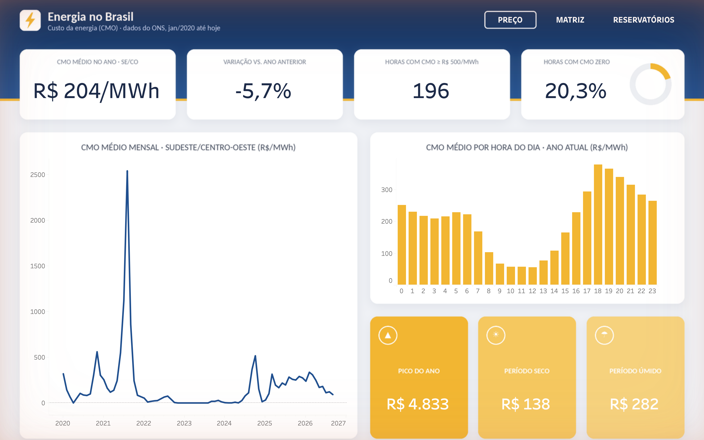
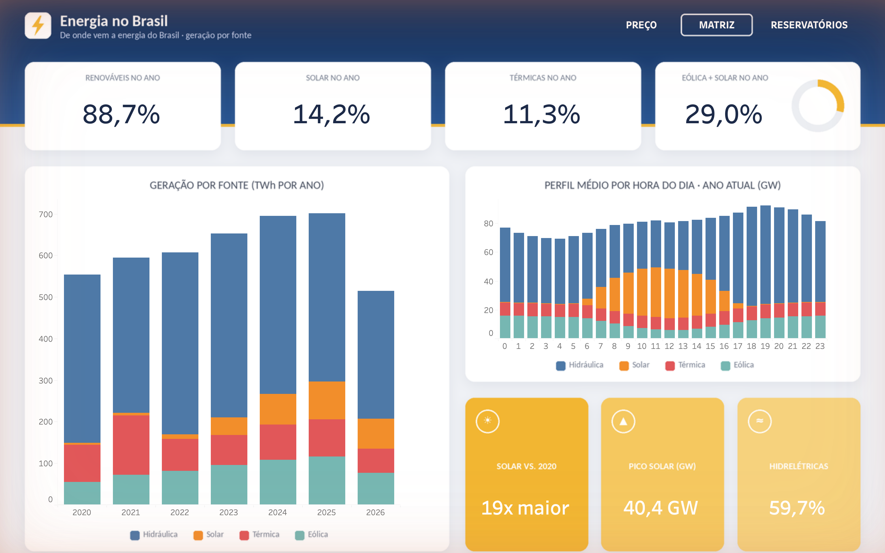
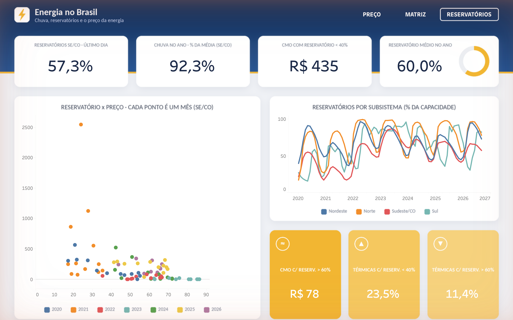

# ⚡ Energia no Brasil — o que faz o preço da energia subir?

Projeto de engenharia e análise de dados com **dados abertos do ONS** (Operador Nacional do Sistema Elétrico), de jan/2020 até hoje.
Pergunta de negócio: **quanto a chuva, os reservatórios e o crescimento da energia solar explicam o custo da energia no Brasil?**

Essa é a pergunta que comercializadoras de energia, indústrias eletrointensivas e consultorias do setor fazem todo mês para decidir quando comprar energia, quando travar contratos e quando se proteger de picos de preço.

📊 **Dashboard interativo no Tableau Public:** [abrir o dashboard](https://public.tableau.com/app/profile/felipe.gabriel.coelho.de.santana/viz/energia_dashboard/Preo)



---

## Principais resultados

| Achado | Número |
|---|---|
| Reservatório do SE/CO **abaixo de 40%** → CMO médio | **R$ 435/MWh** |
| Reservatório **acima de 60%** → CMO médio | **R$ 78/MWh** (5,6x mais barato) |
| Correlação mensal reservatório x preço (SE/CO) | **−0,45** |
| Crise hídrica de ago/2021 | CMO ≈ R$ 3.000/MWh, reservatórios em 24%, chuva a 59% da média, 37% de térmicas |
| "Curva do pato": CMO ao meio-dia vs. às 18h (ano atual) | **R$ 56 vs. R$ 378** (6,7x) |
| Participação da solar na geração | **0,9% (2020) → 14,2% (2026)** |
| Renováveis na matriz no ano atual | **88,7%** |
| Horas com CMO zero no ano atual | **20,3%** das horas |

**Leitura de negócio:** o preço da energia no Brasil ainda é, antes de tudo, uma função da água nos reservatórios. Mas a solar já muda o formato do dia: sobra energia (e o preço cai a zero) no meio do dia, e o preço sobe forte no fim da tarde, quando o sol se põe e o consumo continua alto. Quem consome energia pode deslocar carga para o meio do dia; quem compra energia precisa olhar o nível dos reservatórios para antecipar picos.

---

## Arquitetura

```
ONS (S3 público, CSV por ano)
        │
        ▼
Google Colab / Jupyter  ── notebooks/01_ingestao_limpeza.ipynb
  ingestão · perfil dos dados · limpeza · validações
        │
        ▼
DuckDB  data/energia.duckdb
  bronze  (CSV brutos, como vieram do ONS)
  silver  (tipos corrigidos, deduplicado, outliers marcados)
        │
        ▼
dbt  (dbt-duckdb)
  staging → intermediate → marts (core + dashboard)
  42 testes de qualidade (PASS=42, ERROR=0)
        │
        ├──► DBeaver: sql/analises.sql (10 análises de negócio)
        │
        ▼
Tableau  tableau/energia_dashboard.twbx (3 páginas com abas)
```

Tudo é orquestrado por `pipeline.py` (VS Code → ▶ Run Python File). Uma execução completa leva cerca de 3 minutos.

---

## Fontes de dados (ONS, dados abertos)

| Conjunto | Granularidade | Uso |
|---|---|---|
| Balanço de energia por subsistema | horária | geração por fonte (hidráulica, térmica, eólica, solar), carga e intercâmbio |
| CMO — Custo Marginal de Operação | semi-horária | preço da energia (proxy do PLD) |
| EAR — Energia Armazenada | diária | nível dos reservatórios (% da capacidade) |
| ENA — Energia Natural Afluente | diária | chuva que chega aos rios (% da média histórica) |

Os arquivos ficam no bucket público `ons-aws-prod-opendata` (um CSV por ano, separador `;`).
Usei o **CMO** do ONS como preço porque o download do PLD da CCEE bloqueia acesso automatizado; os dois andam muito próximos (o PLD é o CMO com piso e teto regulatórios).

---

## Qualidade e limpeza dos dados

No notebook (Colab):

- **Padronização de texto:** códigos de subsistema chegavam com espaços (`"N  "`) em alguns anos, o que quebrava os joins. Todas as colunas de texto passam por `strip`.
- **Duplicatas:** registros reenviados pelo ONS são deduplicados mantendo a versão mais recente.
- **Outliers de preço:** CMO acima de R$ 5.000/MWh é anulado e marcado (`flag`), sem apagar a linha.
- **Valores negativos** (ex.: geração com consumo interno) são mantidos e marcados.
- **Linha "SIN"** (total do país) separada dos subsistemas para não somar em dobro.
- **Validação do balanço energético:** geração + intercâmbio ≈ carga fecha em **99,88%** das horas.

No dbt, testes genéricos (`not_null`, `unique`, `accepted_values`, `relationships`) e 5 testes específicos:

| Teste | O que garante |
|---|---|
| `assert_uma_linha_por_subsistema_hora` | grão da tabela fato sem duplicatas |
| `assert_balanco_energetico_fecha` | geração e carga batem dentro da tolerância |
| `assert_reservatorio_entre_0_e_100` | EAR sempre em faixa válida |
| `assert_cmo_sem_valores_absurdos` | preço dentro do teto definido |
| `assert_cobertura_cmo` | toda hora com geração tem preço |

---

## Modelagem (dbt)

```
staging/        stg_balanco_horario · stg_cmo_semihorario · stg_ear_diario · stg_ena_diario
intermediate/   int_cmo_horario (CMO de 30 min → média horária) · int_hidrologia_diaria
marts/core/     dim_subsistema · dim_calendario (período seco mai–nov / úmido dez–abr)
                fct_energia_horaria · fct_hidrologia_diaria
marts/dashboard mart_energia_dashboard (≈236 mil linhas: subsistema × hora)
                mart_matriz_perfil (perfil horário por fonte) · mart_resumo_anual
```

A documentação e o grafo de linhagem são gerados com `dbt docs generate`.

---

## Dashboard (Tableau)

Três páginas com navegação por abas (botões de navegação de verdade, não imagens):

| Página | O que mostra |
|---|---|
| **Preço** | CMO médio mensal desde 2020, CMO por hora do dia, horas com preço zero e acima de R$ 500, período seco x úmido |
| **Matriz** | geração por fonte a cada ano, perfil de cada fonte ao longo do dia, crescimento da solar |
| **Reservatórios** | reservatório x preço mês a mês, nível por região, participação das térmicas conforme o reservatório |

Os indicadores são campos calculados com **LOD** (`{ FIXED : MAX([ano]) }`) e sempre mostram o ano mais recente da base, sem nada fixo no código.

| | |
|---|---|
|  |  |

O fundo do painel (cabeçalho, cartões e legendas) é gerado em Python (`scripts/gerar_fundo_dashboard.py`) e o workbook é montado a partir de uma base criada no Tableau (`scripts/montar_twbx.py`), para que o layout seja reproduzível.

---

## Como rodar

### Opção 1 — VS Code (tudo de uma vez)

1. Abra a pasta do projeto no VS Code.
2. Abra `pipeline.py` e clique em **▶ Run Python File**.
3. O script cria o `.venv` (Python 3.9–3.12), instala as dependências, executa o notebook, roda o dbt e exporta os dados do Tableau. O log fica em `logs/pipeline.log`.

Também dá para rodar uma etapa só: `python3 pipeline.py dbt` (etapas: `setup`, `notebook`, `dbt`, `export`, `kpis`).

### Opção 2 — Google Colab (ingestão e limpeza)

1. Envie `notebooks/01_ingestao_limpeza.ipynb` para o Google Drive e abra com o Colab.
2. Execute todas as células. O notebook baixa os dados do ONS, faz o perfil, a limpeza, as validações e cria o `energia.duckdb`.
3. Para baixar o banco pronto, mude `BAIXAR_BANCO = True` na última célula.

### DBeaver

1. Nova conexão → **DuckDB** → arquivo `data/energia.duckdb`.
2. Abra `sql/analises.sql` e rode bloco a bloco (10 análises: curva do pato, faixas de reservatório, correlação, horas de preço zero, spread entre submercados, dias mais caros etc.).

### Tableau

Abra `tableau/energia_dashboard.twbx` no Tableau Public ou Desktop, ou veja online: https://public.tableau.com/app/profile/felipe.gabriel.coelho.de.santana/viz/energia_dashboard/Preo

---

## Estrutura

```
energia-brasil-analytics/
├── pipeline.py                  # orquestrador (VS Code ▶)
├── notebooks/01_ingestao_limpeza.ipynb
├── dbt/                         # modelos, seeds, testes e macros
├── sql/analises.sql             # 10 análises para o DBeaver
├── scripts/                     # exportação, fundo e montagem do dashboard
├── tableau/energia_dashboard.twbx
├── docs/img/                    # prints do dashboard
└── requirements.txt
```

## Ferramentas

Python · pandas · Google Colab · DuckDB · dbt · SQL · DBeaver · VS Code · Tableau

## Próximos passos

- Agendar o pipeline para rodar todo dia (GitHub Actions).
- Incluir o PLD oficial da CCEE.
- Modelo de previsão do preço com base em chuva e reservatórios.

---

**Autor:** Felipe Gabriel Coelho de Santana · Dados: ONS (dados abertos, [dados.ons.org.br](https://dados.ons.org.br))
